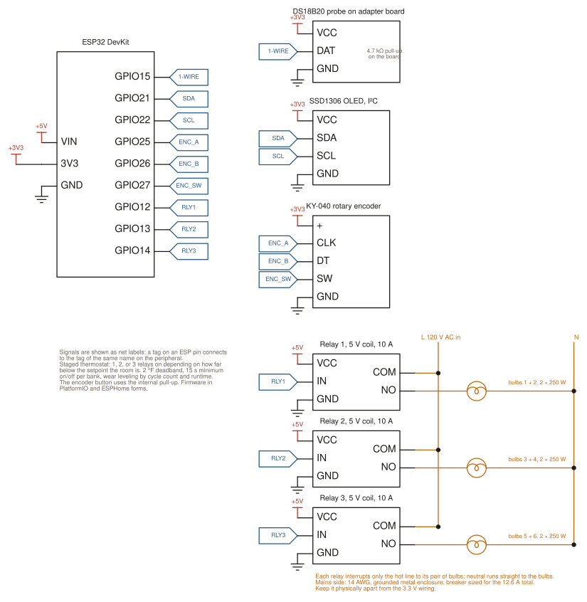

# Heat lamp sauna controller

A thermostat for a near-infrared sauna: an ESP32 stages three banks of heat lamp
bulbs in and out to hold a setpoint, with rules that keep the bulbs from cycling
themselves to death. Built for a sauna my coach put together at the gym, which had
no temperature control and nothing stopping it from overheating.

Writeup: [nickcupo.com/projects/sauna-controller](https://nickcupo.com/projects/sauna-controller)

Two implementations of the same controller:

- `firmware/`: the original, PlatformIO + Arduino. Standalone: OLED, encoder, web
  page on port 80, OTA. No Home Assistant needed.
- `esphome/`: an ESPHome rewrite that exposes it as a `climate` entity in Home
  Assistant with the same pins.

## Control

There is no PID; bulbs cannot dim. It is a staged thermostat with a deadband:

| Temperature vs setpoint | Banks on |
|---|---|
| more than 2 °F above | none |
| within ±2 °F | hold |
| 2 to 10 °F below | one |
| 10 to 15 °F below | two |
| 15 °F or more below | three |

Rules that protect the bulbs (PlatformIO firmware):

- 15 s minimum on and off time per bank.
- Turn on the bank that has rested longest, with a penalty for lighting a bank next
  to one that is already on, so heat spreads across the room.
- Wear leveling by cycle count and runtime.
- Last on, first off.
- Cycle counts and runtime persist to flash and show on a stats screen.

## Hardware

| Part | Pin |
|---|---|
| DS18B20 probe, 4.7 kΩ pull-up to 3V3 | GPIO15 |
| SSD1306 128×64 OLED, I²C | SDA GPIO21, SCL GPIO22 |
| KY-040 rotary encoder | CLK GPIO25, DT GPIO26, SW GPIO27 |
| 3-channel 10 A relay module | IN1 GPIO12, IN2 GPIO13, IN3 GPIO14 |

Each relay switches two 250 W bulbs, about 4.2 A at 120 V. Mains side: 14 AWG,
grounded metal enclosure, breaker sized for the load, low-voltage wiring kept apart
from the 120 V side. Do this part properly or not at all.

## Build

PlatformIO: copy `firmware/include/secrets.example.h` to `secrets.h`, fill it in,
`pio run -t upload` from `firmware/`. Then `http://sauna.local/`.

ESPHome: copy `esphome/secrets.yaml.example` to `secrets.yaml`, then
`esphome run esphome/sauna-controller.yaml`. See `esphome/QUICKSTART.md`.

## Known gap

If the probe disconnects, the firmware keeps heating on the last good reading. A
sauna with a dead sensor should fail off. That is the first fix on the list, along
with a hard ceiling that cuts every relay regardless of setpoint.

## License

MIT.
